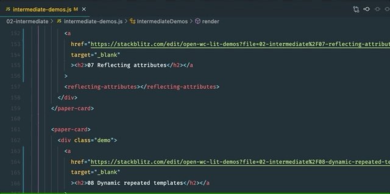

# vscode-web-components-peek

This extension extends Web components code editing with `Go to Definition` and `Peek Definition` support for components and filenames in single-file components with a _`.js`_ and _`.ts`_ extension.
It allows quickly jumping to or peeking into files that are referenced as components (from template), or as module imports (from script).

## Features

- [Go to Defnition](https://code.visualstudio.com/docs/editor/editingevolved#_go-to-definition): jump directly to the css file or open it in a new editor (`F12`)
- [Peek](https://code.visualstudio.com/docs/editor/editingevolved#_peek): load the css file inline and make quick edits right there. (`Ctrl+Shift+F12`)

## Contributing

Contributions and suggestions are greatly appreciated.

## Release Notes

### 1.0.1

- Fix git repo link

### 1.0.0

- Initial release

**Enjoy!**
